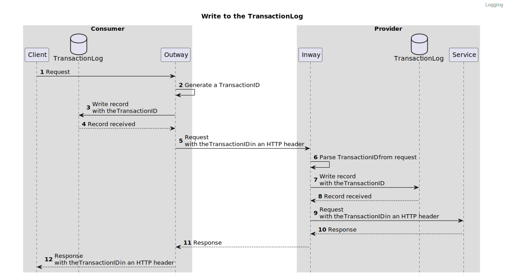

# Architecture

## Writing to the TransactionLog

A Peer makes an HTTP request to a Service. The Outway will generate a unique ID for the Transaction and write a record to the TransactionLog **before** proxying the request to the Inway.
The Inway will parse the unique ID from the request and also write a record containing the unique ID to its own TransactionLog **before** proxying the request to the Service.

> The storage of the log record MAY be implemented both synchronously or asynchronously. For both implementations it is REQUIRED to receive confirmation that the log record is persisted in order to continue.
> For example, you can introduce a message broker to improve performance. The message broker will ensure the records are persisted later on.

1. The client sends a request to the Outway.
2. The Outway generates a unique ID to be used as the TransactionID.
3. The Outway writes the record for transaction in the TransactionLog. 
4. The TransactionLog confirms to the Outway that the record has been received.
5. The Outway proxies the request to the Inway and includes the TransactionID in the HTTP header `Fsc-Transaction-Id`.
6. The Inway reads the unique ID from the request.
7. The Inway writes the record for transaction in the TransactionLog.
8. The TransactionLog confirms to the Inway that the record has been received.
9. The Inway proxies the request to the Service and includes the TransactionID in an HTTP header.
10. The Service returns the response to the Inway.
11. The Inway return the response to the Outway.
12. The Outway returns the response to the client. The response includes the TransactionID in an HTTP header.

## Providing the TransactionLog

A Peer provides the TransactionLog to other Peers. A Peer can request the records of the TransactionLog through the Manager of a Peer.
The Manager returns only logs records that involve the Peer requesting the log records.

1. Peer A requests the TransactionLog from Peer B.
2. Peer B returns the TransactionLog records that contain Peer B.

## Connecting log records

Each log record will have a TransactionID which is the unique ID for the Transaction. This ID is used to link the log records of a Transaction made across multiple Peers.
It is **RECOMMENDED** to also add the TransactionID to logs created by other applications involved with the Transaction. E.g. the client making the request or the API offered as Service. This will enable Peers to provide a detailed audit trail of a request.   
