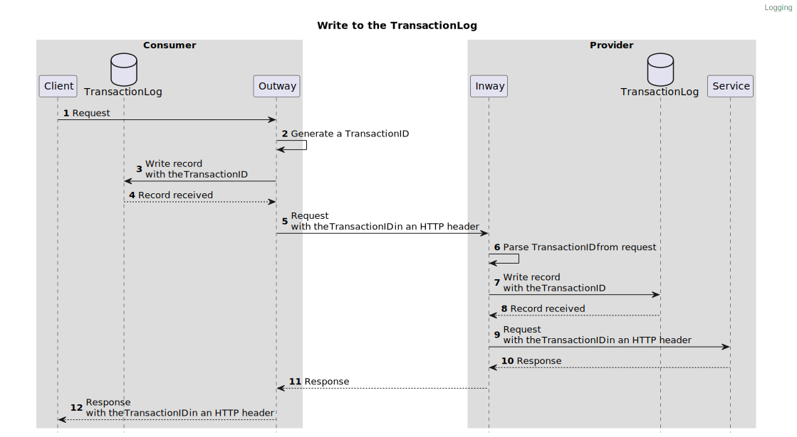
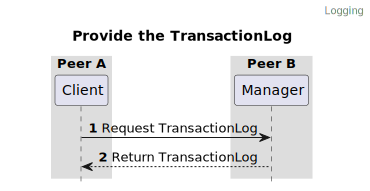

%%%
title = "FSC - logging"
abbrev = "FSC - logging"
ipr = "trust200902"
submissiontype = "independent"
area = "Internet"
workgroup = ""
keyword = ["Internet-Draft"]

[seriesInfo]
name = "Internet-Draft"
value = "draft-fsc-logging-00"
stream = "independent"
status = "informational"

# date = 2022-11-01T00:00:00Z

[[author]]
initials = "E."
surname = "Hotting"
fullname = "Eelco Hotting"
organization = "Hotting IT"
  [author.address]
   email = "rfc@hotting.it"

[[author]]
initials = "R."
surname = "Koster"
fullname = "Ronald Koster"
organization = "VNG"
  [author.address]
   email = "rfc@phillyshell.nl"

[[author]]
initials = "H."
surname = "van Maanen"
fullname = "Henk van Maanen"
organization = "AceWorks"
  [author.address]
   email = "henk.van.maanen@aceworks.nl"

[[author]]
initials = "N."
surname = "Dequeker"
fullname = "Niels Dequeker"
organization = "VNG"
  [author.address]
   email = "niels.dequeker@vng.nl"

[[author]]
initials = "E."
surname = "van Gelderen"
fullname = "Edward van Gelderen"
organization = "vanG IT"
  [author.address]
   email = "e.van.gelderen@vang.nl"

[[author]]
initials = "P.M."
surname = "Gaemers"
fullname = "Pim Marcel Gaemers"
organization = "apily"
[author.address]
email = "pim.gaemers@apily.dev"

%%%

.# Abstract

TODO

{mainmatter}

# Introduction

This RFC is an extension of the Federated Service Connectivity (FSC) Core specification. This extension describes how Peers should log requests made to Services and how Peers should provide log records to other Peers.

## Purpose

Organizations should handle data in a transparent and responsible manner, partly this means that each organization should keep a log of data handled by the organization and provide insight into this log to relevant parties. FSC aims to uniform the logging of API requests to lay the groundwork for more extensive logging requirements like GDRP. 
As it is impossible to create a logging standard that will satisfy the requirements of each individual organization, FSC will focus on logging the properties of an API request of which FSC can guarantee its authenticity e.g. the Peer making the request, the Peer receiving the request, the Service that is being called etc.
Organizations can use this as a foundation to create a log that will satisfy all their needs.

## Overall Operation of Logging

A client makes a request to a Service of the Group. The Outway will receive this request and write a log record with a unique ID before proxying the request to the Inway offering the Service. The Outway will include the unique ID in the request made to the Inway. The Inway also writes a log record containing the same unique ID before proxying the request to the Service.

Peers can request log records from other Peers. Peers provide only log records in which the requesting Peer is an active party. 
 
Log records between Peers can be matched using the unique ID.

## Requirements Language {#header}

The keywords "MUST", "MUST NOT", "REQUIRED", "SHALL", "SHALL NOT", "SHOULD", "SHOULD NOT", "RECOMMENDED", "NOT RECOMMENDED", "MAY", and "OPTIONAL" in this document are to be interpreted as described in [BCP 14](https://www.rfc-editor.org/info/bcp14) [RFC2119](https://www.rfc-editor.org/rfc/rfc2119) [RFC8174](https://www.rfc-editor.org/rfc/rfc8174) when, and only when, they appear in all capitals, as shown here.

## Terminology

This section lists terms (#header) and abbreviations that are used in this document. This document assumes that the reader is familiar with the Terminology of FSC Core.

*Transaction:*

A request made by a Peer to a Service.

*TransactionLog:*  

A Peers log of Transactions. This log can contain both incoming and outgoing requests.

*TransactionID:*  
  
A unique identifier which can be used to trace a Transaction between Peers.

# Architecture

## Writing to the TransactionLog

A Peer makes an HTTP request to a Service. The Outway will generate a unique ID for the Transaction and write a record to the TransactionLog before proxying the request to the Inway.
The Inway will parse the unique ID from the request and also write a record containing the unique ID to its own TransactionLog before proxying the request to the Service.

> The storage of the log record MAY be implemented both synchronously or asynchronously. For both implementations it is REQUIRED to receive confirmation that the log record is persisted in order to continue. 
> For example, you can introduce a message broker to improve performance. The message broker will ensure the records are persisted later on.
  
!---

!---

## Providing the TransactionLog

A Peer provides the TransactionLog to other Peers. A Peer can request the records of the TransactionLog through the Manager of a Peer. 
The Manager returns only logs records that involve the Peer requesting the log records.   

!---

!---

## Connecting log records 

Each log record will have a TransactionID which is the unique ID for the Transaction. This ID is used to link the log records of a Transaction made across multiple Peers.
It is **RECOMMENDED** to also add the TransactionID to logs created by other applications involved with the Transaction. E.g. the client making the request or the API offered as Service. This will enable Peers to provide a detailed audit trail of a request.   

# Specification 

## Log record {#log_record}

The fields that a log record **MUST** contain are described in the [OpenAPI Specification](logging/logging.yaml)

### Access token

Data from the access token **MUST** be used to fill the following fields of the log record: 

`accessToken.gth` -->  `logRecord.grant_hash`
`accessToken.sub` -->  `logRecord.source.outway_peer_id`
`accessToken.iss` -->  `logRecord.destination.service_peer_id`
`accessToken.svc` -->  `logRecord.service_name`

in case of a Peer making a request on behalf of another Peer an additional field **MUST** be set:

`accessToken.cdi` --> `logRecord.source.delegator_peer_id`

in case of a request made to a Service offered on behalf of another Peer and additional field **MUST** be set:

`accessToken.pdi` --> `logRecord.destination.delegator_peer_id`

## Manager

The FSC Log specification requires the Manager described in Core to be implemented.

### Behavior

#### Providing TransactionLog records

The Manager **MUST** be able to provide log records to other Peers.

The Manager **MUST** only return log records which match the following criteria:

- The Peer ID of the X.509 certificate used by the Peer requesting the log records matches the value of the field `logRecord.source.outway_peer_id`
- The Peer ID of the X.509 certificate used by the Peer requesting the log records matches the value of the field `logRecord.destination.service_peer_id`

If the Delegation extension is enabled the following two criteria also apply:

- The Peer ID of the X.509 certificate used by the Peer requesting the log records matches the value of the field `logRecord.source.delegator_peer_id`
- The Peer ID of the X.509 certificate used by the Peer requesting the TransactionLog records matches the value of the field `logRecord.destination.delegator_peer_id`

### Interface

The Manager **MUST** implement the interface described in the [OpenAPI Specification](logging/logging.yaml)

## Inway

The FSC Log specification requires the Inway described in Core to be implemented.

### Behavior

#### Writing to the TransactionLog

The Inway **MUST** write a record to the TransactionLog for each received request for a Service.

The Inway **MUST** use the TransactionID provided by the Outway in the HTTP header `Fsc-Transaction-Id`.

The Inway **MUST** add the TransactionID to the request sent to the Service using the HTTP header `Fsc-Transaction-Id`.

The TransactionLog record **MUST** contain the fields described in the [log record section](#log_record)

The Inway **MUST** deny the request if the record to the TransactionLog could not be written. 

#### Delegation 

When the requesting Peer is making the request on behalf of another Peer the source of a log record **MUST** contain a sourceDelegated object as described in the [OpenAPI Specification](logging/logging.yaml).

When the Service is published on behalf of another Peer the destination of a log record **MUST** contain a destinationDelegated as described in the [OpenAPI Specification](logging/logging.yaml).

#### Error response

This extension introduces a new error code for the Inway:

- `TRANSACTION_LOG_WRITE_ERROR`: The TransactionLog record could not be created.

## Outway

The FSC Log specification requires the Outway described in Core to be implemented.

### Behavior

#### Writing to the TransactionLog

The Outway **MUST** write a record to the TransactionLog for each request that will be sent to the Inway.

The Outway **MUST** create a TransactionID which **MUST** be unique for the transaction.

The Outway **MUST** add the TransactionID to the request sent to the Inway using the HTTP header `Fsc-Transaction-Id`.

The TransactionLog record **MUST** contain the fields described in the [TransactionLog record section](#transaction_log_record)

The Outway **MUST** deny the request if the record to the TransactionLog could not be written.

The Outway **MUST** add the TransactionID to the response sent to the Client using the HTTP header `Fsc-Transaction-Id`.

#### Delegation

When the requesting Peer is making the request on behalf of another Peer the source of a log record **MUST** contain a sourceDelegated object as described in the [OpenAPI Specification](logging/logging.yaml).

When the Service is published on behalf of another Peer the destination of a log record **MUST** contain a destinationDelegated as described in the [OpenAPI Specification](logging/logging.yaml).

#### Error response

This extension introduces a new error code for the Outway:

- `TRANSACTION_LOG_WRITE_ERROR`: The TransactionLog record could not be created.

# References

# Acknowledgements

{backmatter}
